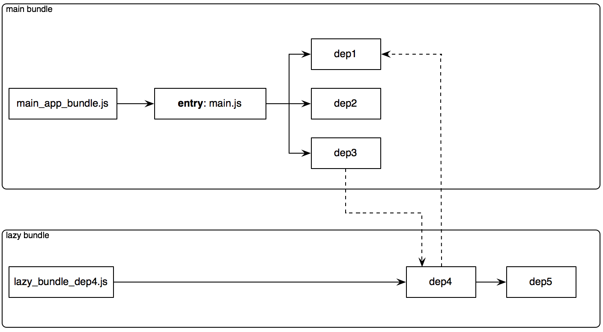

# extractify
Browserify plugin to extract code to be lazy or on-demand loaded into separate bundles aka code-splitting.

### install
```
npm install extractify
```

### how it works
Following diagram summarizes how extractify works:



1. `dep4` module in above diagram is determined to be loaded as on-demand and should be stripped from the main bundle `main_app.js`.
2. Therefore it will have its own stripped bundle, `lazy_bundle_dep4.js` which will be loaded later.
3. The stripped bundle will also include the modules what `only` `dep4` depends on. In this case `dep5` is only used by `dep4`. `dep1` module, on the other hand, is included in main bundle since it was already used by main_app.js.
4. Optionally a map object which holds defer loaded module name and bundle name key value pairs can be injected into main entry or different `.json` config file soft or hard. See `bundleMapOption` options below


### usage
You can use extractify as a browserify plugin:
``` js
browserify -p [ extractify OPTIONS ]

  // see below for OPTIONS
```

### options
``` js
// Sample OPTIONS
{
  {
    bundleMapOption: {
      injectSoft: false,
      dest: 'lazy_bundle/map.json'
    }
  },
  lazy: [
    {
      entries: [
        './files/dep4.js'
      ],
      outfile: './lazy_bundle/lazy_bundle_dep4.js'
    }
  ]
}
```

- `bundleMapOption`: optional property that instructs how the map object will be injected into source or written into file system
  - `injectSoft`: instructs how the map object will be injected. If it is true, it will be written to the dest file  [default: true]
  - `dest`: optional location of map destination .json map file which holds module name and bundle name key value pairs
- `lazy`: holds the lazy entry and output files definition.
  - `entries`: array of the entry module names to build stripped lazy bundle
  - `outfile`: name of the stripped lazy bundle


### api plugin example
``` js
var browserify = require('browserify');
var fs = require('fs');
var b = browserify(['./files/main.js'], {
    basedir: __dirname
});
b.plugin('extractify', {
  lazy: [
    {
      entries: [
        './files/dep4.js'
      ],
      outfile: './bundles/lazy_bundle_dep4.js'
    }
  ]
});
b.bundle().pipe(fs.createWriteStream('./bundles/main_app.js'))

```

### events
#### b.on('lazyWritten', function (outfile) {})
Emits right after the splitted bundle written into the file system
```
  outfile: name of the extracted bundle
```

#### b.on('lazyStream', function (stream) {})
Each splitted bundles will emits `stream` before written into filesystem.
The outfile name is available as `stream.file`.

### license
MIT
